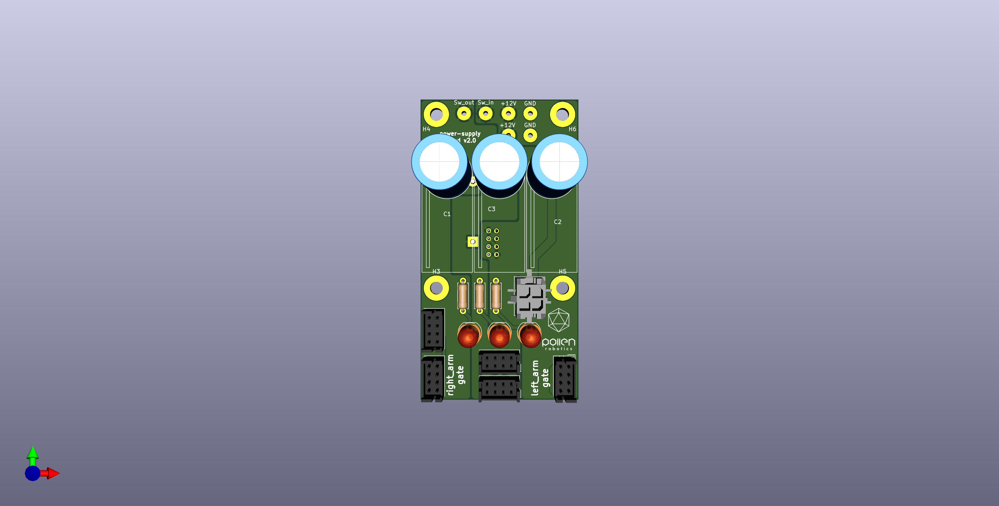

# Reachy's Power Supply board
This repository contains the KiCad project of the board used to power the different parts of Reachy and to allow the robus communication between the module and the computer. It is also used to power on/off the NUC computer.

## Features:

- Switch for activate or not the 12V input in the motorised parts of Reachy
- Connector to power the NUC computer
- Robus connectors to plug the parts of Reachy in, and the gate boards used to make the communication of the parts with the computer
- Leds to know if there is voltage on the motors (generated by the power source or by themselves)
